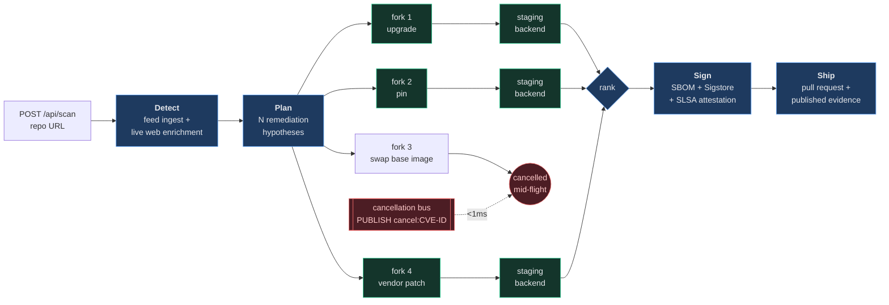
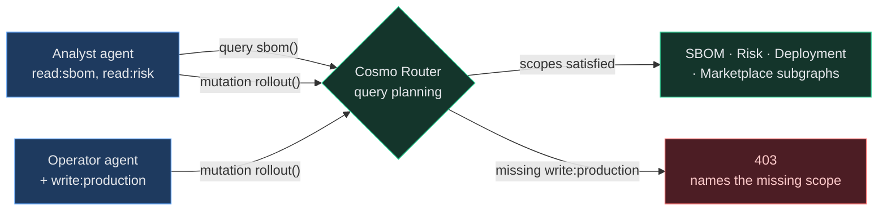

# Phalanx

[](https://github.com/ElijahUmana/phalanx/actions/workflows/ci.yml)
[](LICENSE)
[](tsconfig.json)
[](https://nextjs.org)

**Speculative CVE remediation.** When a vulnerability lands, Phalanx forks your dependency state N ways, tests N different fixes concurrently against live backends, kills the losing branches mid-flight the instant one is disproved, and ships the survivor with a signed evidence chain.

Every other tool in this space tests one hypothesis at a time. That is the whole idea.

---

## The mechanism

Remediation is a search problem, and the search is usually run serially by a human: try the upgrade, wait for CI, find it breaks a peer dependency, try pinning instead, wait again. Each attempt costs a full test cycle, so in practice teams try one thing and file a ticket.

Phalanx makes the branches cheap enough to run at the same time. Copy-on-write database forks cost ~500ms and only pay storage for divergent blocks, so four remediation strategies can be live simultaneously, each against its own isolated backend. A pub/sub cancellation bus means the moment any branch proves a CVE is a false positive — or that a strategy is dead — every other in-flight branch is torn down in under a millisecond instead of running to completion.



---

## Capability surface

Each capability is a role in the pipeline. The service implementing it is an interchangeable detail.

| Role in the pipeline | Why it has to exist | Implementation |
|---|---|---|
| **Copy-on-write state forks** | Speculation is only affordable if a branch costs milliseconds and near-zero storage. Without it the architecture collapses to one-hypothesis-at-a-time. | Ghost — `ghost fork --wait --json`, 4KB-block CoW |
| **Sub-millisecond coordination + cancellation** | A branch disproved at second 3 must not keep burning compute until second 90. | Redis 8 — Streams with consumer groups, Pub/Sub cancel, native Vector Sets |
| **Per-operation scope enforcement** | Autonomous agents that can write to production are a blast radius. Authority has to be enforced below the agent, not prompted into it. | WunderGraph Cosmo — federated supergraph, `@requiresScopes` per field |
| **Isolated staging per hypothesis** | You cannot claim a fix works without running the patched code somewhere real. | InsForge — one provisioned backend per branch |
| **Live web action** | Patch metadata frequently exists on a vendor page hours before it reaches NVD, and shipping a fix means opening a PR. | TinyFish — browser agents for advisory retrieval, version lookup, PR creation |
| **Governed agent execution** | Every model call and tool use in a system that edits code needs to land in an immutable log. | Guild — sandboxed runtime, credentials injected at call time |
| **Verified remediation baseline** | "Upgrade to a safe image" is only meaningful if the target image's provenance is checkable. | Chainguard — `dfc` conversion, `cosign` Sigstore + SLSA L3 verification |
| **Feed ingestion** | CVE data arrives from several sources in several shapes. | Nexla — NVD, OSV, GHSA normalization |
| **Evidence publication** | The output of a security action is the audit artifact, not the diff. | Senso → `cited.md` |
| **Agent payment rails** | Metered access to external intelligence, paid per query by the agent itself. | x402 + Coinbase CDP on Base Sepolia |

---

## Two ideas worth stealing

### Capability security for agents, enforced at the data layer

Prompt-level guardrails ask an agent not to do something. Phalanx makes it structurally unable to. Every field in the federated supergraph carries `@requiresScopes`, and the router enforces it during query planning — before any subgraph is reached.



An MCP gateway exposes the supergraph to agents as **persisted operations only**, with `variableKeys` pinned — an agent selects an operation and fills declared variables, it cannot reshape the query. The authority boundary is the router, not the prompt.

### One event envelope across every subsystem

Thirteen independently built subsystems integrate because they share exactly one convention: take `scanId` first, emit through one function.

```ts
export interface PhalanxEvent {
  scanId: string;
  type: string;
  source: EventSource;   // 12-value union — one per subsystem
  timestamp: number;
  data: Record<string, unknown>;
}
```

Everything publishes to `scan:events:{scanId}`; the SSE route at `/api/status` streams that channel straight to the dashboard. Adding a subsystem means adding one union member. No subsystem imports another.

---

## How a scan runs

```
POST /api/scan  →  { scanId, streamUrl }        orchestration is detached
GET  /api/status?scanId=…                       SSE, 15s heartbeat, 5min ceiling
```

| Phase | Work |
|---|---|
| 0 | Fetch and parse the dependency manifest from the target repo |
| 1 | Ingest CVE feeds, enrich the candidate from vendor pages and PoC sources |
| 2 | Similarity search against historical CVEs, dispatch analysis, federated queries under scope |
| 3 | Fork state per hypothesis, provision a staging backend per fork |
| 3b | Cancel disproved branches across the bus |
| 4 | Retrieve patch metadata, settle metered intelligence queries |
| 5 | Rank survivors, human-in-the-loop approval gate |
| 5b | Convert base image, verify signature and attestation, generate SBOM |
| 6 | Open the pull request, publish the evidence package |

---

## Implementation status

The pipeline instruments its own degraded paths — events carry `source: 'fixture'`, `synthetic: true`, or a `fallbackReason` whenever a live call was substituted, so the dashboard shows you which is which at runtime. Stated plainly here for the same reason.

| Subsystem | Status |
|---|---|
| Live web retrieval, version lookup, PR creation | Live |
| Redis coordination — Streams, Pub/Sub cancel, Vector Sets | Live |
| Copy-on-write forks and pgvector similarity | Live; falls back to a synthetic completion event if a fork exceeds its deadline |
| Cosmo federation, scope enforcement, MCP gateway | Live router and real enforcement; subgraphs resolve from seeded data, JWKS issuer is a local mock |
| Evidence publication | Live |
| Governed agent sessions | Live for the analysis and approval agents |
| Signature and attestation verification | Live where `cosign`/`dfc` are installed; falls back to committed fixtures otherwise, flagged as such |
| Feed ingestion | Live for NVD and OSV |
| Hypothesis scoring | **Not yet real.** Branch ranking is deterministic from the hypothesis name rather than from a test suite executed in the staging backend. This is the main gap between the architecture and the implementation. |
| Metered payment | Wallet, balance, and the x402-guarded route are live; the settlement shown in the demo flow is not a real transaction |

---

## Run it

Requires Node 20+, pnpm, and a Redis instance. Ghost, Guild, Senso, and the Chainguard CLIs (`cosign`, `dfc`, `mal`) are optional — the pipeline degrades to instrumented fixtures without them.

```bash
git clone https://github.com/ElijahUmana/phalanx.git
cd phalanx
pnpm install
cp .env.example .env.local        # fill in what you have; missing keys degrade gracefully
```

```bash
# terminal 1 — federated supergraph: 4 subgraphs, router, MCP gateway, JWKS mock
bash cosmo/scripts/start-all.sh

# terminal 2 — dashboard and API
pnpm dev
```

Open `http://localhost:3000/dashboard` and submit a GitHub repository URL.

```bash
# or drive it from the API
SCAN=$(curl -s -X POST http://localhost:3000/api/scan \
  -H 'Content-Type: application/json' \
  -d '{"repoUrl":"https://github.com/ElijahUmana/phalanx-demo-target"}' | jq -r .scanId)

curl -N "http://localhost:3000/api/status?scanId=$SCAN"
```

### Checks

```bash
pnpm lint          # eslint
pnpm typecheck     # tsc --noEmit, strict
pnpm build         # next build
```

Integration scripts under `scripts/` exercise live services and need real credentials:

```bash
pnpm test:redis    pnpm test:ghost      pnpm test:tinyfish
pnpm test:scopes   pnpm test:chainguard pnpm test:wundergraph
```

### Container

The image builds on Chainguard's distroless Node — a security tool whose own runtime carries CVEs would be self-defeating.

```bash
docker build -t phalanx .
docker run -p 3000:3000 --env-file .env.local phalanx
```

---

## Layout

```
src/
├── app/api/scan/       POST — starts a scan, returns immediately
├── app/api/status/     SSE — streams the scan's event channel
├── app/dashboard/      live pipeline view
├── lib/events/         the event envelope + emitter — the integration seam
├── lib/scan/           orchestrator: phase sequencing, cancellation, ranking
├── lib/ghost/          CoW forks, pgvector similarity search
├── lib/redis/          streams, pub/sub, vector sets, semantic cache
├── lib/wundergraph/    scope-aware federated client
├── lib/tinyfish/       advisory retrieval, vendor portals, PR creation
├── lib/guild/          agent session orchestration, typed I/O boundaries
├── lib/chainguard/     dfc conversion, SBOM, Sigstore + SLSA verification
├── lib/insforge/       staging backend provisioning per hypothesis
├── lib/nexla/          CVE feed ingestion
├── lib/x402/           agent wallet and payment guard
└── lib/senso/          evidence publication
cosmo/                  4 gRPC subgraphs, router config, MCP gateway, JWKS mock
skills/phalanx/         agent-installable skill definition
```

---

## License

MIT — see [LICENSE](LICENSE).
